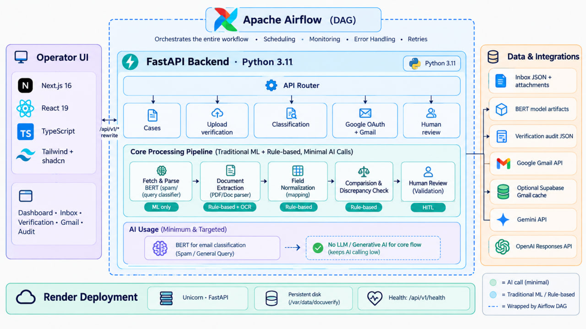

# DocuVerify

Deployment: [no-cost Render backend with Vercel](DEPLOYMENT_RENDER_FREE.md), or [paid Render persistent-disk setup](DEPLOYMENT_VERCEL_RENDER.md).

DocuVerify is a shipping-document verification workspace for the Averis x Monash hackathon. It helps operations teams turn inbound shipping emails into a reviewable case queue: classify each request, extract seven shipping fields from Shipping Instructions (SI) and draft Bills of Lading (BL), compare the available evidence, and send uncertain cases to a human reviewer.

## Problem-solution alignment

Shipping teams often receive document requests as unstructured email, then manually locate attachments, identify the request type, transcribe fields, and compare instructions with draft documents. That process is slow, difficult to audit, and vulnerable to missed discrepancies.

DocuVerify aligns the solution with that workflow instead of replacing the reviewer. It presents a shared queue, links each case to its source email and attachments, extracts the fields needed for SI/BL comparison, exposes confidence and review reasons, and keeps human decisions visible in the dashboard. The system can accelerate routine cases while making low-confidence or conflicting evidence easier to investigate.

The seven target fields are `shipper`, `consignee`, `notify_party`, `port_of_loading`, `port_of_discharge`, `container_count`, and `gross_weight_kg`. Supported categories are `BL_COMPARISON`, `SI_REQUEST`, `INVOICE_QUERY`, `GENERAL`, and `SPAM`.

## Architecture Diagram
<p align="center">
  
</p>

## AI and cloud infrastructure integration

The frontend is a Next.js dashboard. Vercel serves the interface and rewrites ordinary `/api/v1/*` requests to the backend. Long-running upload and extraction requests can call Render directly through `NEXT_PUBLIC_BACKEND_URL` so they do not depend on the Vercel proxy timeout.

The backend is a FastAPI service running on Uvicorn with one worker. It owns provider calls, Gmail OAuth, attachment validation, classification, document ingestion, and Gemini extraction. Provider credentials stay in Render environment variables and are never exposed to browser code.

Classification uses the fine-tuned local BERT model during local development. The Render Free deployment precomputes demo classifications locally and stores them in an encrypted archive, allowing the 512 MB service to serve the 520-case mailbox without loading the 439 MB model. New emails use hosted Gemini classification. Gemini also performs native PDF extraction and returns extraction status and review reasons.

The demo archive contains the authorized inbox and attachments but excludes model weights and organizer answer keys. It is encrypted before being committed, decrypted only at backend startup, and restored to temporary storage because Render Free has no persistent disk. Google OAuth state and sessions are memory-only, so the service uses one worker and a restart requires users to sign in again.

## User feedback and testing

The current validation combines automated tests, deployment checks, and manual browser checks.

- The backend test suite passes 103 tests.
- The deployed backend restores 520 inbox records and 250 attachments.
- Health checks pass through both Render and the Vercel rewrite.
- Attachment download, new-email upload, hosted classification, and Gemini extraction have been exercised against the deployed service.
- Extraction returns all seven target fields and exposes review reasons when evidence is incomplete or conflicting.
- CORS accepts the production Vercel origin, and the Google OAuth flow reaches the configured Vercel callback.

Manual product feedback should focus on whether reviewers can understand why a case needs attention, correct extracted values quickly, find source evidence, and complete Google/Gmail actions without losing context. Future feedback should be collected from reviewer corrections, false classifications, extraction disagreements, and time spent per case.

## Coding challenges

- The participant bundle and BERT model are ignored by Git, while the hosted demo still needs its mailbox and attachments. Deployment therefore uses an encrypted archive and startup restoration.
- The BERT model is large relative to Render Free memory. Cached demo predictions preserve the queue while hosted Gemini handles new classification requests.
- Gemini extraction can run longer than a normal proxy request. The frontend routes those operations directly to Render and the backend uses bounded provider timeouts.
- Attachment paths are resolved beneath the authorized bundle directory, preventing case records from downloading arbitrary server files.
- OAuth state and Gmail tokens are process-local. One worker is required until a shared session store is introduced.
- Provider failures, low confidence, disagreement, missing attachments, and incomplete fields remain explicit review conditions rather than silent approvals.

## Success metrics

### Validated now

- 520 demo cases restored after a fresh Render deployment.
- 250 demo attachments available through the bundle path resolver.
- 103 backend tests passing.
- Health, case-list, attachment, upload, classification, extraction, CORS, and Vercel rewrite smoke checks passing.
- Seven extraction fields returned by the deployed extraction flow.
- Google OAuth redirect accepted by Google for the production Vercel callback.

### Future targets

Production evaluation should track classification precision and recall by category, field-level extraction accuracy, the percentage of cases requiring human review, reviewer correction rate, median and p95 extraction latency, upload success rate, OAuth/Gmail completion rate, cold-start impact, service availability, and provider cost per processed case. These are targets for measurement, not claims about current production performance.

## Scalability plans

The next stage is to move session state and review decisions into shared services, then add durable object storage for uploaded documents and extracted reports. A background job queue should handle long Gemini requests and Gmail ingestion so browser requests are short and retryable.

After removing the memory-only OAuth and session assumptions, the backend can scale across workers and instances. A smaller or quantized classifier, model-serving endpoint, or batch inference worker can replace the current cached-prediction compromise. Tenant authorization, rate limiting, structured logs, metrics, tracing, backup and retention policies, and provider circuit breakers should be added before handling private multi-user mailboxes.

## Project structure

```text
frontend/                     Next.js / React dashboard
  app/                        Pages, layouts, and theme styles
  components/                 Reusable UI components
  lib/                        Frontend utilities
  public/                     Static assets
  scripts/                    Browser smoke checks
  data/                       Sample shipping emails for verification
  types/                      Shared shipping and audit types
  docs/                       Frontend workflow documentation
backend/
  data_prep/                  Offline labelling, extraction, datasets, and self-checks
  app/
    main.py                   FastAPI application factory and middleware
    api/routes/               HTTP endpoints, composed by api/router.py
    core/                     Environment-based configuration
    schemas/                  Pydantic API contracts
    services/                 Classification, ingestion, extraction, and uploads
    integrations/             External provider adapters
  tests/                      Backend tests
  resources/
    sdoc-hackathon-bundle/     Original participant data and loader
    sdoc-hackathon-docker/     Original organizer inbox/scoring server
  pyproject.toml              Python dependencies and test configuration
  run.py                      Backend development server launcher
DocuVerify Hackathon Proposal.md
```

The repository tracks both frontend and backend code. The review workflow runs within the Next.js app at `/verification`; see its [file responsibilities](frontend/docs/verification.md). The Python dataset pipeline and its generated data live under `backend/data_prep/`; see its [commands and file responsibilities](backend/data_prep/README.md).

## Current functionality

The dashboard includes a case queue, SI/BL comparison, editable extracted values, confidence indicators, local review/approval/escalation interactions, JSON export, audit views, light/dark themes, and a collapsible sidebar. Review corrections and activity are currently frontend session state, while case data, uploads, classification, extraction, Google sign-in, and Gmail access use the FastAPI backend. See [frontend notes](frontend/FRONTEND.md).

The FastAPI application provides health checks, classification, demo cases, attachment downloads, uploads, Gemini extraction, Google OAuth, and Gmail access. The supplied SDOC server remains an independent optional service; its `/submit` endpoint scores submissions rather than approving dashboard cases.

The seven target fields are `shipper`, `consignee`, `notify_party`, `port_of_loading`, `port_of_discharge`, `container_count`, and `gross_weight_kg`. For evaluation, follow the supplied bundle's categories and output schema (`BL_COMPARISON`, `SI_REQUEST`, etc.), which differ from some proposal labels.

## Run the frontend

Use Node.js compatible with the installed Next.js version (Node 20.9+).

```powershell
cd frontend
npm ci
npm run dev
```

Open http://localhost:3000. Existing installations can skip `npm ci`. Previous preview processes were stopped for the directory move; restart them from this new location.

```powershell
npx tsc --noEmit
npm run build
```

## Run the backend

Python 3.11+ is required. From the workspace root:

```powershell
cd backend
python -m venv .venv
.\.venv\Scripts\python.exe -m pip install -e ".[dev]"
Copy-Item .env.example .env
.\.venv\Scripts\python.exe run.py
```

With the virtual environment activated, start the backend with `python run.py`.
API docs: http://localhost:8000/docs. Health: http://localhost:8000/api/v1/health.
On macOS/Linux use `.venv/bin/python` in place of `.\.venv\Scripts\python.exe`.
Environment configuration uses the `DOCUVERIFY_` prefix. Set `DOCUVERIFY_CORS_ORIGINS` to a JSON array of actual frontend origins when using another port. Local bundle paths default to an absolute path derived from the backend directory, not the shell's working directory.

Run tests from `backend/`:

```powershell
.\.venv\Scripts\python.exe -m pytest
```

## Run the supplied inbox/scoring server (optional)

With Docker Desktop running, from the workspace root:

```powershell
cd backend/resources/sdoc-hackathon-docker
docker compose up --build
```

The supplied server listens at http://localhost:8080. Its relative Docker build and data-mount paths are unchanged. See its [README](backend/resources/sdoc-hackathon-docker/README.md) and the [participant bundle instructions](backend/resources/sdoc-hackathon-bundle/README.md).

**Organizer data warning:** the Docker package contains `data_v2/ground_truth.json`, an answer key. Do not distribute that package to participants or publish the answer key. The root `.gitignore` excludes this file from new commits, but does not remove it from any existing history. Do not enable `REVEAL_GT` in shared environments. The new API does not serve the resources directory.

## Backend development conventions

Keep route handlers thin, validate API contracts in `schemas/`, put pipeline logic in `services/`, and isolate external I/O in `integrations/`. Add tests alongside each implemented feature. Add database models/migrations only when choosing persistence; do not place business logic inside the bundled organizer server. Dependency ranges are initial scaffold constraints; lock tested versions before deployment.

Router organization follows the [FastAPI multi-file application guide](https://fastapi.tiangolo.com/tutorial/bigger-applications/). The original [proposal](DocuVerify%20Hackathon%20Proposal.md) describes the intended full pipeline, not completed functionality.
