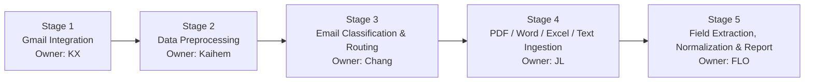

# DocuVerify Architecture — 5-Stage Team Breakdown

This document converts the current architecture sketch into five clearly separated stages so each team member can develop their own module in parallel while sharing agreed input/output contracts.

## Overall Flow



---

# Stage 1 — Gmail Integration & User Workspace
**Owner: KX**

### Objective
Connect the application to the user's Gmail account and provide the basic workspace for viewing incoming document-verification cases.

### Responsibilities
- Implement **Google OAuth** login.
- Request the Gmail permissions required by the application.
- Fetch the user's emails using the **Gmail API**.
- Retrieve email metadata such as:
  - Email ID
  - Sender
  - Subject
  - Body
  - Timestamp
  - Attachment names
- Pass fetched emails into the backend processing pipeline.
- Build or coordinate the left-side application navigation:
  - **Overview**
  - **Verification Inbox**
  - **Documents**
  - **Audit Trail**

### Suggested Output Contract

```json
{
  "email_id": "email_001",
  "sender": "customer@example.com",
  "subject": "Please verify SI and BL",
  "body": "Please review the attached draft BL.",
  "received_at": "2026-09-20T10:30:00+08:00",
  "attachments": [
    {
      "filename": "shipping_instruction.pdf",
      "mime_type": "application/pdf"
    },
    {
      "filename": "draft_bl.pdf",
      "mime_type": "application/pdf"
    }
  ]
}
```

### Definition of Done
- User can log in with Google.
- Application can fetch at least one test email.
- Email data is returned in the agreed JSON format.
- A mock/local email source is available as a fallback so this stage does not block the rest of the team.

---

# Stage 2 — Data Preprocessing
**Owner: Kaihem**

### Objective
Clean and prepare raw email information before it is passed to the classifier.

### Responsibilities
- Clean the email subject and body.
- Remove unnecessary signatures, repeated reply chains, HTML noise, and irrelevant formatting where possible.
- Extract useful metadata from the email.
- Prepare attachment metadata for downstream processing.
- Produce a consistent text payload for the classifier.
- Handle malformed or empty emails gracefully.

### Example Input

```json
{
  "subject": "RE: Draft BL Checking",
  "body": "<html>Please compare attached BL against SI...</html>",
  "attachments": [
    "SI.pdf",
    "Draft_BL.pdf"
  ]
}
```

### Example Output

```json
{
  "email_id": "email_001",
  "clean_subject": "Draft BL Checking",
  "clean_body": "Please compare attached BL against SI.",
  "attachment_names": [
    "SI.pdf",
    "Draft_BL.pdf"
  ]
}
```

### Definition of Done
- The preprocessing function accepts Stage 1 output.
- It always returns the same schema.
- The classifier can consume the output without additional cleaning.

---

# Stage 3 — Email Classification, Confidence & Routing
**Owner: Chang**

### Objective
Determine whether an email is relevant to the document-verification workflow and decide what should happen next.

### Responsibilities
- Use a lightweight LLM, BERT-style classifier, or other classifier to categorize the email.
- Initial categories may include:
  - `DOCUMENT_COMPARISON`
  - `NEW_SI_REQUEST`
  - `GENERAL`
  - `SPAM`
  - `OTHER`
- Return a classifier confidence score.
- Route only relevant document-comparison emails into the SI/BL processing pipeline.
- If the classification confidence is below the agreed threshold:
  - mark the case for **Human-In-The-Loop (HITL)** review.
- If a manager/operator rejects the automated interpretation:
  - store the correction;
  - optionally prepare a suggested response email;
  - keep the corrected label for later model improvement.

### Suggested Output Contract

```json
{
  "email_id": "email_001",
  "classification": "DOCUMENT_COMPARISON",
  "confidence": 0.93,
  "requires_human_review": false,
  "reason": "Email explicitly asks to compare draft BL with SI."
}
```

### Recommended Routing Logic

```text
confidence >= threshold
        |
        +--> relevant document request --> Stage 4
        |
        +--> irrelevant category -------> log / skip

confidence < threshold
        |
        +--> HITL review
```

### Definition of Done
- Classifier returns only approved category values.
- Confidence and routing decision are included.
- Low-confidence cases can be identified without breaking the pipeline.

---

# Stage 4 — Attachment Ingestion, PDF Parsing & OCR
**Owner: JL**

### Objective
Convert SI and BL attachments into content that the extraction model can reliably understand.

### Responsibilities
- Receive attachments only from relevant classified emails.
- Accept **PDF, DOCX, XLSX, and TXT** attachments. Legacy DOC/XLS must first be exported to a supported format.
- The Stage 4 handoff requires an email `tag` of `SI` or `DL` and attachment references; the earlier Stage 3 classification-only example is not sufficient for ingestion.
- Detect whether a PDF contains machine-readable text.
- If text is available:
  - use a parser such as `pdfplumber` or `Docling`.
- If the PDF is scanned/image-based:
  - use OCR or a multimodal model.
- Preserve useful source information:
  - page number
  - extracted text
  - document type
  - optional bounding boxes / evidence locations
- Identify which attachment is likely the **SI** and which is likely the **BL**.

### Suggested Output Contract

```json
{
  "email_id": "email_001",
  "documents": [
    {
      "document_type": "SI",
      "filename": "SI.pdf",
      "pages": 2,
      "text": "SHIPPER: ABC Manufacturing...",
      "ocr_used": false
    },
    {
      "document_type": "BL",
      "filename": "Draft_BL.pdf",
      "pages": 2,
      "text": "BILL OF LADING...",
      "ocr_used": true
    }
  ]
}
```

### Definition of Done
- At least one digital PDF can be parsed.
- At least one scanned PDF can be handled through OCR/model fallback.
- Word paragraphs/tables, Excel sheets/rows, and UTF-8/UTF-16 text can be parsed.
- Stage 5 receives readable text for both SI and BL.
- Parsing failure is returned as a controlled error/status instead of crashing the pipeline.

### Implemented Stage 3 → Stage 4 Handoff

`POST /api/v1/ingestion` accepts the contract below. The same operation is available as `app.services.ingestion.ingest_email` without running earlier stages.

```json
{
  "email_id": "email_001",
  "tag": "SI",
  "requires_human_review": false,
  "attachments": [
    {"filename": "SI.docx", "path": "case_001/SI.docx", "document_type": "SI"},
    {"filename": "Draft_BL.xlsx", "path": "case_001/Draft_BL.xlsx", "document_type": "BL"}
  ]
}
```

Paths are relative to the configured bundle's `attachments/` directory. Stage 1 must store attachment bytes there before this handoff; attachment names alone cannot be parsed. The input `tag` accepts only `SI` or `DL`. Pending human-review emails return `review_required` without opening attachments.

Email tags and attachment types are separate: `DL` is preserved as supplied, without assuming it means `BL`. Explicit attachment types may be `SI`, `DL`, or `BL`; otherwise filename/content heuristics suggest a type, with ambiguous documents marked `UNKNOWN` for review. Stage 5 continues to use `SI` and `BL` for comparison.

The response retains the original suggested document fields and adds per-document `status`, `error`, `warnings`, and `segments`. Segments carry page numbers for PDF, sheet/row locations for XLSX, and block locations for DOCX. `pages` is null for non-PDF documents because pagination is not established by these parsers. Top-level `status` is `ok`, `partial`, `error`, or `review_required`; `requires_human_review` also flags warnings and ambiguous types. Stage 5 must check these fields before consuming text.

OCR requires Tesseract with English language data on the server PATH. Sparse PDF pages (fewer than 40 non-whitespace characters) trigger OCR, including pages in mixed digital/scanned PDFs. OCR errors are preserved per page. Embedded Word/Excel images and dense PDFs containing additional scanned regions need manual review; this implementation does not promise full layout reconstruction. Excel formula expressions are retained and flagged for review, not evaluated. See `backend/README.md` for local mock execution and limitations.

---

# Stage 5 — Field Extraction, Normalization, Comparison & Report
**Owner: FLO**

### Implemented automatic handoff

`POST /api/v1/ingestion` now calls `app.services.verification.process_email`:
Stage 4 `ingest_email` reads attachments once, then Stage 5
`extract_ingested_fields` consumes its parsed text and calls
`extract_fields_from_text`. Source segments, OCR results, and ingestion errors
remain in the response alongside `fields`, `extraction_status`, and
`review_reasons`. The response's `requires_human_review` covers both stages;
`status` continues to describe ingestion. Missing/mismatched fields, ambiguous
roles, duplicate SI/BL documents, and partial parsing require review.

This implementation uses deterministic field extraction. The LLM and report
contract described below remain design targets. Legacy cases/export callers
retain their file-based extraction entry points. See `backend/README.md` for
the automated endpoint and Python usage.

### Objective
Extract the required shipping fields from SI and BL documents, normalize them, compare them, and generate the final discrepancy report.

### Responsibilities

#### A. Structured Field Extraction
Use an LLM with structured output to extract the required fields:

- `shipper`
- `consignee`
- `notify_party`
- `port_of_loading`
- `port_of_discharge`
- `container_count`
- `gross_weight_kg`

For the MVP, start with **one extraction model**. A second independent model can be added later as a verification layer if time allows.

#### B. Field Normalization
Normalize extracted values before comparison.

Examples:
- Remove punctuation and extra whitespace from company names.
- Normalize common company suffixes.
- Convert weights into kilograms.
- Convert container counts to integers.
- Map port aliases to canonical names/codes.
- Use fuzzy matching only where deterministic matching is insufficient.

#### C. SI vs BL Comparison
Compare the normalized values field by field.

Example:

```json
{
  "field": "gross_weight_kg",
  "si_value": 12450,
  "bl_value": 12540,
  "match": false
}
```

#### D. Human Review Trigger
If any of the following occur, flag the case for HITL:
- missing field;
- unreadable document;
- low extraction confidence;
- conflicting extraction;
- uncertain normalization;
- ambiguous comparison.

#### E. Report Generation
Produce the final result in a stable JSON format.

### Suggested Final Output Contract

```json
{
  "case_id": "case_001",
  "status": "REVIEW_REQUIRED",
  "si": {
    "shipper": "ABC Manufacturing Sdn Bhd",
    "consignee": "XYZ Trading Pte Ltd",
    "notify_party": "XYZ Trading Pte Ltd",
    "port_of_loading": "Port Klang",
    "port_of_discharge": "Singapore",
    "container_count": 5,
    "gross_weight_kg": 12450
  },
  "bl": {
    "shipper": "ABC Manufacturing Sdn Bhd",
    "consignee": "XYZ Trading Pte Ltd",
    "notify_party": "XYZ Trading Pte Ltd",
    "port_of_loading": "Port Klang",
    "port_of_discharge": "Singapore",
    "container_count": 5,
    "gross_weight_kg": 12540
  },
  "mismatches": [
    {
      "field": "gross_weight_kg",
      "si_value": 12450,
      "bl_value": 12540
    }
  ],
  "requires_human_review": true
}
```

### Definition of Done
- All seven fields can be extracted into the agreed schema.
- SI and BL values can be normalized and compared.
- Mismatches are clearly identified.
- A final report JSON is generated.
- Low-confidence or incomplete cases are routed to HITL.

---

# Integration Contract Between Team Members

To reduce merge conflicts, each stage should behave like an independent module:

```text
KX
Stage 1 output
    |
    v
Kaihem
Stage 2 output
    |
    v
Chang
Stage 3 output
    |
    v
JL
Stage 4 output
    |
    v
FLO
Stage 5 final output
```

Each owner should agree not to change another stage's JSON schema without informing the team.

A recommended folder structure is:

```text
docuverify/
├── frontend/
│   ├── overview/
│   ├── verification-inbox/
│   ├── documents/
│   └── audit-trail/
│
├── backend/
│   ├── stage1_gmail/
│   ├── stage2_preprocessing/
│   ├── stage3_classification/
│   ├── stage4_document_ingestion/
│   ├── stage5_verification/
│   └── schemas/
│
├── tests/
│   ├── sample_emails/
│   └── sample_documents/
│
└── README.md
```

## Two-Day Integration Rule

Every stage should first be tested with a mocked input matching the previous stage's output schema. This allows all five people to work in parallel without waiting for another module to be completed.

For example, JL should be able to test Stage 4 using a sample Stage 3 JSON file even if Chang's classifier is not finished yet. FLO should be able to test Stage 5 using sample parsed-document JSON even if OCR is still being developed.

The team should integrate incrementally rather than waiting until the end to merge all five stages.
